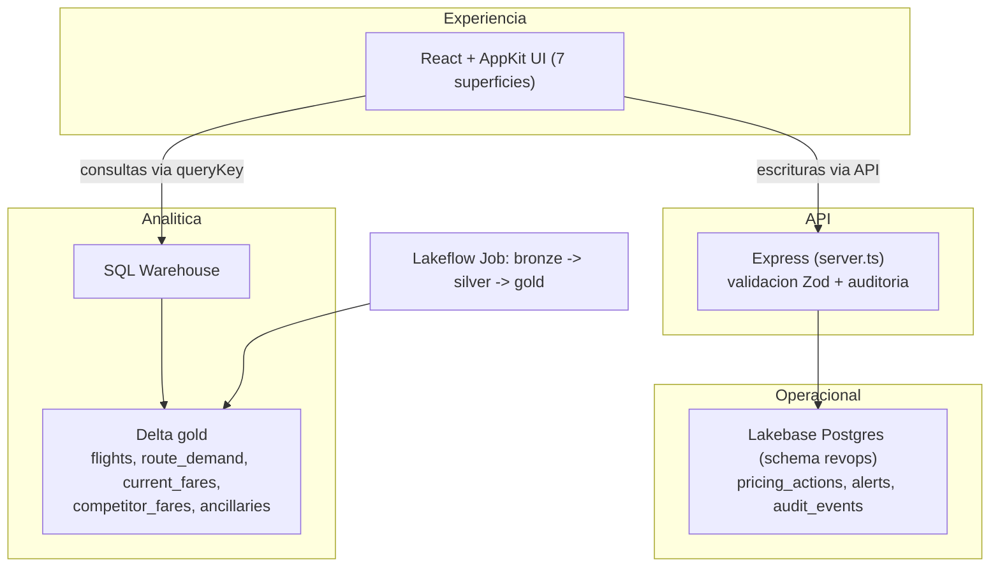

# Avianca Revenue Operations

Hub operacional de Revenue Management de rutas sobre Databricks. No es un tablero de
solo lectura: sigue el patron analizar, decidir y actuar. Ven la demanda, la ocupacion,
el revenue y el precio propio contra el de la competencia por ruta; el motor de reglas
recomienda subir, bajar o mantener con el porque a la vista; y cada decision se propone,
se aprueba y se aplica desde la app, dejando rastro de auditoria.

App en vivo (Free Edition, requiere login de la cuenta): https://avianca-rev-ops-7474656088326790.aws.databricksapps.com

> Aviso. Esta es una demo con datos sinteticos. Las recomendaciones de precio salen de
> un motor de reglas transparente, no de un modelo aprobado. No la usen para decisiones
> reales de pricing sin validar la logica y las fuentes con su equipo de Revenue.

## Las 7 superficies

1. **Resumen ejecutivo.** KPIs de red (revenue del periodo, load factor, RASK, ancillary por pasajero, alertas abiertas, acciones pendientes), cada uno con unidad, periodo, comparacion y frescura del dato. Tendencia de revenue en el tiempo.
2. **Explorador de rutas.** Tabla de las 16 rutas con ocupacion, indice de demanda, revenue, tarifa propia contra la mediana de competidores, brecha y la accion recomendada. Pagina del lado del servidor. Al entrar a una ruta: curva de reserva por dias a la salida, serie de demanda y mezcla de ancillary.
3. **Recomendacion de pricing.** Para la ruta elegida muestra los insumos, el motivo, la accion y la tarifa sugerida. Un boton crea la propuesta.
4. **Simulador what-if.** Mueves el cambio de precio y ves demanda, ocupacion y revenue proyectados con el modelo de elasticidad. Puedes guardar el escenario como propuesta.
5. **Accion operacional con aprobacion.** Lista de acciones de pricing con su estado; flujo de aprobar o rechazar y luego aplicar. Aqui vive el ciclo analizar, decidir, actuar.
6. **Alertas.** Anomalias calculadas desde gold y almacenadas en Lakebase (precio bajo o sobre mercado, ocupacion baja, demanda atipica); se reconocen y se cierran.
7. **Asistente conversacional.** Responde preguntas sobre las rutas. Corre en modo demo determinista con SQL predefinido y contesta "No disponible" cuando faltan datos, en vez de inventar. Trae ganchos documentados y desactivados para Genie y Model Serving.

Ninguna mutacion sale del navegador: todo pasa por la API de Express, se valida con Zod
y deja una fila en `audit_events`.

## Arquitectura



Las tablas analiticas se leen por el SQL Warehouse con las consultas de `config/queries/`.
Las tablas transaccionales se leen y escriben por rutas de Express contra Lakebase.

## Modelo de datos

### Delta, catalogo `avianca_revenue_operations`

Lo genera `notebooks/01_generate_revenue_data.py` con semilla fija (reproducible). Capas
`bronze` (crudo) y `gold` (las 5 tablas analiticas); `silver` la materializa el job de
refresco.

- `gold.flights` - una fila por salida: ocupacion, curva de reserva por dias a la salida, revenue.
- `gold.route_demand` - demanda diaria por ruta: indice, busquedas, reservas, pace vs ano anterior.
- `gold.current_fares` - tarifa propia por ruta, cabina y clase. La referencia es Economy Standard.
- `gold.competitor_fares` - tarifas sinteticas de competidores por ruta (ultimos 30 dias).
- `gold.ancillaries` - venta de ancillary por ruta y tipo: unidades, revenue, attach rate.

Escenarios sembrados: rutas casi llenas con precio por debajo del mercado (subir), rutas
flojas con precio por encima (bajar), brechas contra competidores, curva por dias a la
salida e historia suficiente para las series.

### Lakebase Postgres, schema `revops`

Las crea el Service Principal en `onPluginsReady` (idempotente) porque el SP no puede usar
schemas que no creo. Son las transaccionales, las que llevan estado:

- `revops.pricing_actions` - propuestas de cambio y su ciclo (propuesta, aprobada, rechazada, aplicada).
- `revops.alerts` - alertas de negocio con severidad y estado.
- `revops.audit_events` - bitacora de toda mutacion (actor, accion, entidad, payload).

## Como se despliega

### Camino corto (recomendado)

Clona el repo y despliega en un paso. Compila local y sube el build.

```bash
databricks apps deploy --profile <tu-perfil>
```

Requiere Node y el CLI de Databricks locales, y las variables del bundle resueltas
(warehouse y los nombres de recurso de Lakebase, ver `databricks.yml`).

### Camino de URL

El repo trae el build commiteado (`dist/` y `client/dist/`), asi que arranca solo con
`npm install`. En la UI de Databricks Apps crea una app desde este repo publico, y en el
paso de recursos adjunta el warehouse y el recurso `postgres` de tu Lakebase. Los nombres
`projects/.../branches/.../databases/...` son propios de cada workspace; obtenlos con
`databricks postgres list-projects`, `list-branches` y `list-databases`.

## Datos y orquestacion

Corre una vez `notebooks/01_generate_revenue_data.py` para poblar `bronze` y `gold`. El
refresco continuo bronze a gold es un **Lakeflow Job serverless**
(`avianca-rev-ops-medallion-refresh`) con dos tareas de notebook encadenadas
(`01_generate_revenue_data.py` y `resources/notebooks/02_refresh_medallion.py`). Verifique
las Declarative Pipelines en este workspace: corren, pero las tablas gold ya son propiedad
del generador como tablas administradas que la app lee, y un pipeline DLT tendria que
re-adquirirlas y entraria en conflicto de propiedad. Por eso la orquestacion es un Job.

## Permisos requeridos (Service Principal de la app)

- `USE CATALOG` y `USE SCHEMA` sobre `avianca_revenue_operations` y su schema `gold`.
- `SELECT` sobre las 5 tablas de `gold`.
- `CAN_USE` sobre el SQL Warehouse.
- `CAN_CONNECT_AND_CREATE` sobre el recurso Lakebase (para crear el schema `revops` y sus tablas).

Estan declarados en `databricks.yml` con su campo `permission`, asi el SP los recibe en el deploy.

## Autenticacion: SP contra OBO

La app corre con su **Service Principal** (identidad propia). Es lo correcto aqui: el SP
es dueno del schema `revops` que crea al arrancar, y las lecturas analiticas no dependen de
quien mire. Si mas adelante quieren que cada usuario vea solo sus rutas o respetar permisos
por fila, cambien a **On-Behalf-Of** activando `user_api_scopes` en `databricks.yml` (esta
comentado) y ajusten las consultas. Para una demo de red completa, el SP es mas simple y
predecible.

## Seguridad y gobierno

- Cero tokens o contrasenas en el repo. La conexion a Postgres usa credenciales OAuth de corta vida del SP.
- El `.env` local no se versiona; usa `.env.example` como plantilla.
- Toda mutacion pasa por la API, se valida con Zod y deja evento en `audit_events`.
- Gobierno de datos por Unity Catalog.

## Limites de Free Edition

- 3 apps por cuenta. Esta ocupa un slot.
- La app se apaga sola 24 horas despues del deploy. Reiniciala antes de cada sesion.
- Compute serverless y un solo SQL Warehouse.
- El deploy automatico desde Git (`AUTO_SYNC`) esta deshabilitado, por eso el camino de URL trae el build commiteado.

## Correr en local (facilitador)

```bash
npm install
npm run dev
# la app queda en http://localhost:8000
```
